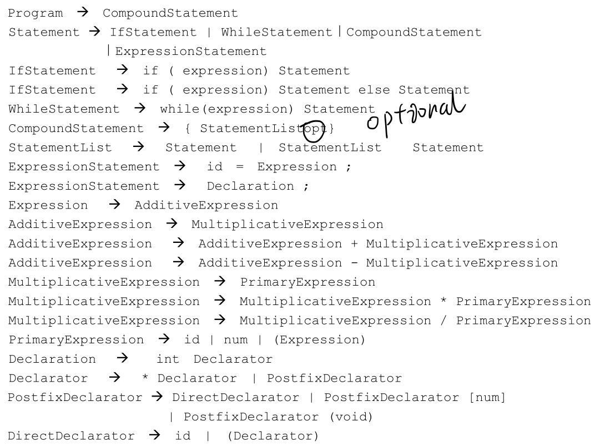

# 一个简单的demo
- 对一个简单文法的分析
  
- 执行结果
```
fun is:function(int,int,int) which returns pointer to array[4] of int 
funPtr is:pointer to function(int,int,int) which returns pointer to function(int) which returns int 
	if(!c) goto Label_0 
	a = f 
	goto Label_1 
Label_0:
	b = k 
Label_1:
x is:int 
	t0 = x + y 
	t1 = t0 * z 
	var = t1 
Label_2:
	t2 = c + d 
	if(!t2) goto Label_6 
Label_3:
	if(!d) goto Label_5 
	if(!e) goto Label_4 
	t3 = d - 1 
	d = t3 
Label_4:
	goto Label_3 
Label_5:
	t4 = c - 1 
	c = t4 
	goto Label_2 
Label_6:
```